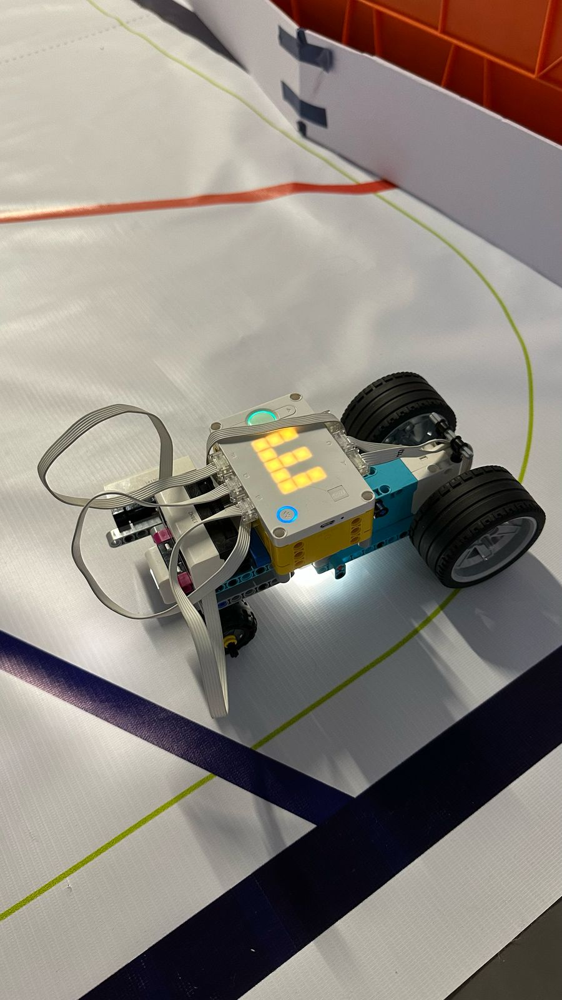
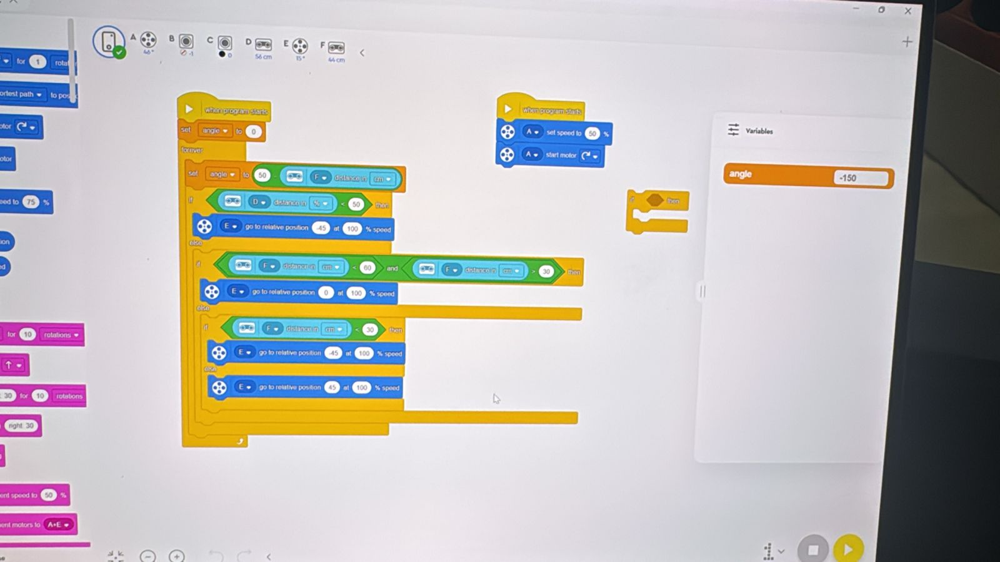
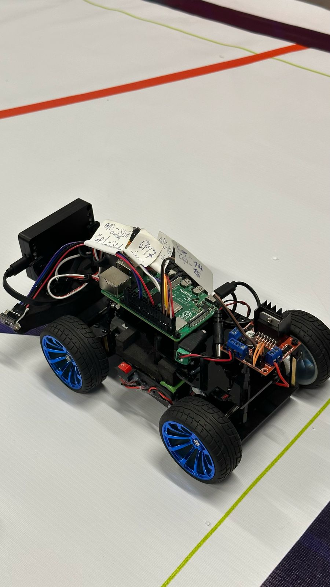
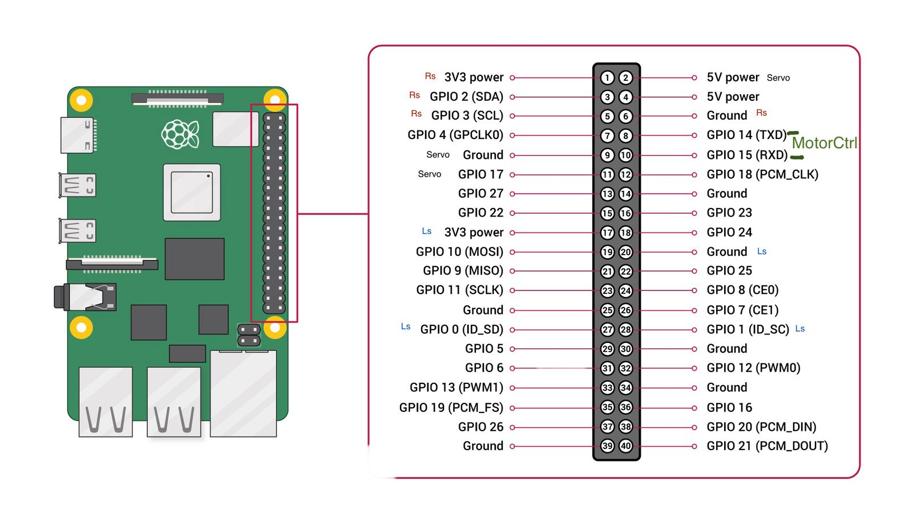
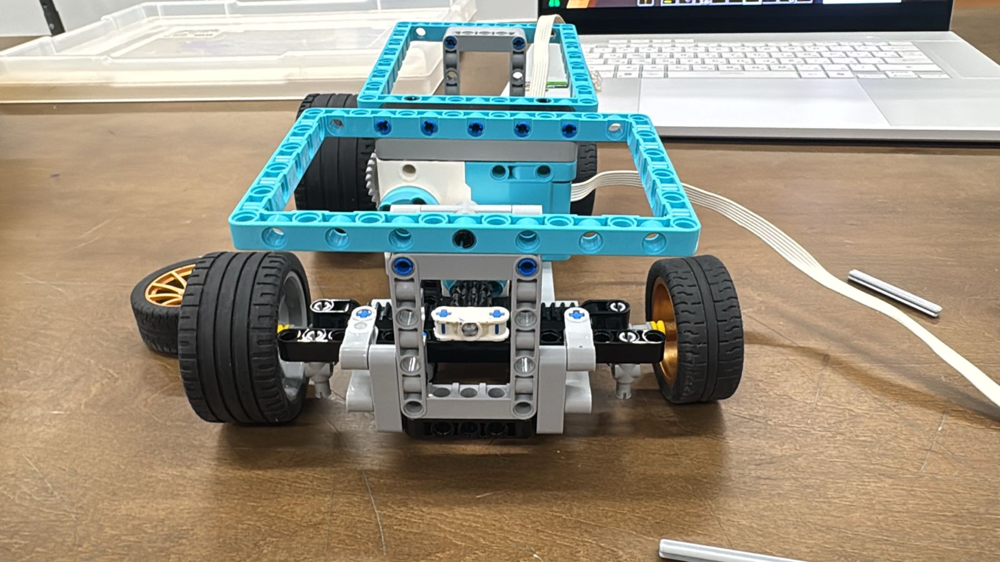
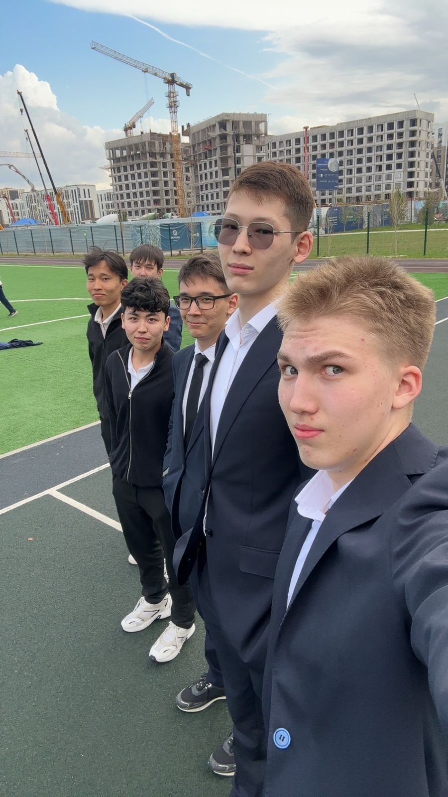

# WRO2025 Autonomous Car

## Project Overview
Our project is an autonomous LEGO-based vehicle built for the World Robot Olympiad (WRO) 2025 Future Engineers challenge. This challenge focuses on creating a self-driving car that can navigate a dynamic course **without human control**. The robot's primary goals are to drive autonomously while accurately detecting turns in the road, avoiding unexpected obstacles, and performing a parallel parking maneuver at the end of its run. We designed and programmed our vehicle to meet these tasks using a combination of sensors and onboard processing, aiming for reliability and speed on the competition track.

The final robot is built on a LEGO Technic chassis controlled by a Raspberry Pi 4 computer. By using open-source hardware and software, we embraced the spirit of the Future Engineers category—leveraging sensor fusion, computer vision, and a steering mechanism akin to a real car (rather than simple differential drive). The result is a compact autonomous car that can react to its environment in real-time and complete the competition’s course tasks. This README serves as both technical documentation for our code/hardware and a reflective engineering journal of our development journey.

## Team Introduction
We are **Tair Kaldybayev** and **Ulan Gauan**, two robotics enthusiasts who teamed up to tackle the WRO 2025 Future Engineers challenge. As a team of two, we shared all roles from brainstorming and designing, to coding and building the robot. Our journey began with simple sketches and ambitious ideas, and evolved through numerous prototypes and late-night debugging sessions. Over the course of the project, we learned to divide tasks based on our strengths and to collaborate when solving complex problems.

The development process was truly an educational adventure. We encountered plenty of setbacks—burnt-out motors, tangled wires, sensor misreadings, code bugs—but each challenge taught us something new. With each iteration of our car, we improved our design and strategy. This README not only documents the final result but also tells the story of how two determined students transformed a concept into a working autonomous vehicle.

## Hardware Setup
Our autonomous car combines a Raspberry Pi brain with LEGO-based mechanics. Below is an overview of the hardware components and how they were used in the final build:

- **Raspberry Pi 4 (4GB)** – The main onboard computer running our Python code. It handles sensor inputs, makes driving decisions, and controls the motors. We chose the Pi 4 for its processing power (needed for handling multiple sensors and possibly vision) and its compatibility with the LEGO interface hardware.
- **Raspberry Pi Build HAT** – An add-on board attached to the Pi’s GPIO header that allows direct connection of LEGO Technic motors and sensors. The Build HAT provides 4 ports (labeled A, B, C, D) to plug in motors or sensors using LEGO cables. It also has its own power input to drive the motors. Using the Build HAT simplified our wiring and let us use high-quality LEGO motors/sensors with the Pi easily.
- **LEGO Technic Motors** – We used three motors from the LEGO Technic (SPIKE Prime) set: two large angular motors for driving the wheels and one medium angular motor for steering. The two drive motors are mounted on the rear wheels of the car, providing independent power to each wheel (this setup gave us control over speed and slight differential steering if needed). The medium motor is linked to the front wheel steering mechanism, allowing the robot to turn left or right like a real car. The encoders built into these motors were crucial for precise control – for example, to turn the steering to a specific angle or to move a certain distance when parking.
- **LEGO Distance Sensors** – Our robot uses the LEGO distance sensor (from the SPIKE Prime kit) to detect obstacles and measure distances. We integrated two of these sensors: one facing forward to sense obstacles in the car’s path, and another angled to the side to help detect intersections (openings for potential turns). These sensors use infrared/time-of-flight technology to measure distance in centimeters. They provided the necessary data to decide when to slow down or initiate an avoidance maneuver. By mounting one sensor looking forward and one to the right side, our car could tell if there was an obstacle ahead or a clear path to the side (useful for detecting a turn or a parking spot).
- **Limelight Camera** – For the vision component, we incorporated a Limelight camera (a small smart camera often used in robotics for vision processing). The camera was mounted at the front of the vehicle to capture the view of the track. We used it to detect visual cues on the field, such as the presence of a distinctive colored marker or line that indicates where the car should turn or stop. The Limelight has onboard processing capabilities, but we primarily used our Raspberry Pi to process the images (via OpenCV), using the camera as a standard USB camera feed. This setup allowed us to experiment with computer vision, adding another layer of information (for instance, recognizing a specific color stripe on the floor that signals the parking area).
- **Chassis and LEGO Structure** – The body of the robot is constructed from LEGO Technic beams and panels. We built a sturdy frame to hold the motors in place and to support the Raspberry Pi and other electronics. The use of LEGO pieces made it easy to iterate on the mechanical design; we could add or remove components and adjust the wheelbase or gear ratios without needing custom fabrication. The chassis also includes a suspension-like flexibility where needed to handle the track’s surface and to ensure all wheels maintained contact for traction.
- **Wiring and Connections** – Most of the connections are handled by LEGO cables into the Build HAT, which simplified wiring. The Build HAT itself connects to the Raspberry Pi’s GPIO pins and communicates via I²C. We powered the Build HAT (and thus the motors) with an external battery pack providing ~8 volts. The Raspberry Pi was powered by a separate USB power bank to ensure it had a stable 5V supply. We paid special attention to cable management: securing the sensor wires and camera cable (a flat ribbon in our case) to the LEGO frame so they wouldn’t tangle in the wheels or obstruct the sensors. In an earlier version, we had a jungle of wires (especially when using a servo and motor driver), but by the final build the wiring was much cleaner thanks to the integrated LEGO cables and the Build HAT.
- **Power Supply** – The robot carries its own power sources for portability. We used a 10,000 mAh USB power bank to run the Raspberry Pi 4, which gave us several hours of runtime. For the motors, we used a 7.5V NiMH battery pack connected to the Build HAT’s power input (the Build HAT can be powered between 7V and 12V; we found around 8V ideal for the LEGO motors’ performance). A power switch was installed to easily turn the motor power on/off without having to disconnect wires. This dual-power setup (separating logic and motor power) prevented motor voltage drops from resetting the Pi and overall made the system more reliable.

With this hardware setup, our robot effectively had the “brains” (Pi), “senses” (distance sensors and camera), and “muscles” (motors) needed to tackle the self-driving challenge.

## Software Architecture
The software for our autonomous car was written primarily in Python and organized into multiple modules for clarity and maintainability. Our codebase was designed to be modular, so we could test individual components (like sensor reading or motor control) in isolation and then integrate them into the full system. Here’s an overview of the software structure and major components:

- **Main Control Script** – We have a main Python program (e.g., `main.py`) that orchestrates everything. When the robot is started, this script is responsible for reading the mode of operation (from a file called `mode.txt`) and then executing the corresponding routines. The main script initializes all components (motors, sensors, camera feed) and then enters a loop that keeps the car driving and making decisions until a goal is reached (such as finishing the course or completing the parking sequence).
- **Mode Selection System** – To easily switch between different behaviors, we implemented a simple mode selection using the `mode.txt` file. This text file contains a keyword that tells the program which mode to run in. We defined three modes: `"test"`, `"speed"`, and `"main"`. In **test mode**, the car runs a simplified routine useful for calibration and debugging (for example, driving forward a short distance or printing sensor values without doing the full navigation). In **speed mode**, the robot focuses on completing a lap as fast as possible (ignoring some of the obstacle avoidance or parking tasks, used to test maximum performance and tune the driving speed). In **main mode**, the full autonomous challenge logic is run – including obstacle avoidance and parallel parking. This mode system was extremely handy during development: we could tweak parameters and try out new code in test mode, measure raw performance in speed mode, and then switch to main mode for integration tests, all by changing a single word in a file rather than altering code.
- **Motor Control Module** – We wrote a module to interface with the motors (an abstraction over the Build HAT’s API). This module includes functions for basic motions like `drive_forward(speed)` or `stop()`, and higher-level maneuvers like `turn_angle(degrees)` or `steer(direction)`. Under the hood, it uses the motor encoders for precision. For example, when we need to turn the front wheels to 30° left, we convert that to the corresponding rotation of the steering motor and command it via the Build HAT API. Similarly, to drive a specific distance, we use wheel encoder data to know how far we've traveled and stop at the desired point. The motor control module also manages acceleration and deceleration – we implemented a simple ramp-up/ramp-down to avoid sudden starts and stops that could cause wheel slip or jerky motion.
- **Sensor Module** – This part of the software handles reading from the LEGO distance sensors (via the Build HAT). It provides functions like `get_front_distance()` and `get_side_distance()`, which return the distance in centimeters detected by the front-facing and side-facing sensors, respectively. We included some filtering in these functions: for instance, taking a moving average of a few readings to smooth out noise, and ignoring any out-of-range spurious values. This module also interprets sensor data in context – for example, determining if an obstacle is “too close” (below a certain threshold, meaning the car should stop or swerve) or if an intersection is detected (e.g., if the side distance suddenly increases, indicating an opening to the right side of the track).
- **Camera (Vision) Module** – For the Limelight camera, we integrated an OpenCV-based vision module. When active, this module grabs frames from the camera and processes them to extract useful information. We experimented with two main vision features: line detection and target detection. For line detection, we tried to detect the colored boundary lines on the WRO track mat to help the robot stay centered in its lane or to know when it was approaching a curve. For target detection, we used color filtering to spot the magenta-colored blocks that mark the parking spot boundaries (in the competition, the parallel parking space is often marked by colored blocks or walls). The vision module would return signals to the main program, such as “red line detected on left” or “parking zone seen ahead”. Because vision processing can be slow and sometimes unreliable under varying lighting, we treated camera data as supplementary – the robot doesn’t solely rely on it, but it can improve decision-making when combined with sensor data (a bit of sensor fusion).
- **Decision-Making Logic** – At the heart of the software is the decision algorithm that runs in a loop during main mode. Each cycle, the robot reads sensors (and camera, if enabled) and decides on an action. For example:
  - If an obstacle is detected close ahead, the logic triggers an obstacle avoidance maneuver (like slowing down and steering around the obstacle, or taking an alternate path if one exists).
  - If the path is clear but the robot senses an opening to the right (and it’s at a point where a turn is expected), it will initiate a right turn maneuver. Turn decisions are also timed/ordered according to the challenge rules (the course might require the car to take specific turns in sequence – our program can be configured with that sequence or attempt to recognize it via markers).
  - After completing the required laps or reaching the final section of the course, the logic will look for the parking area. Once the parking zone is identified (for example, by sensing a clear space of sufficient length with the side sensor, or by the camera recognizing the parking markers), the robot switches to the parking routine. This routine carefully controls the steering and reverse motion to slide the car into the parallel parking spot between two boundaries. We use the distance sensors here as well: the front sensor helps ensure we don’t hit the back wall as we reverse, and the side sensor helps align the car parallel to the curb.
- **Logging and Tuning** – We included debug logging throughout the software (printing out sensor values, decisions, and motor states), especially in test mode. This allowed us to tune thresholds (like what distance to consider “too close” for an obstacle) and to adjust our algorithms based on real-world performance. For example, from logs we noticed our side sensor sometimes picked up false positives (it would momentarily read a very large distance at certain angles, as if seeing an opening where there wasn’t one), so we adjusted the sensor’s mounting angle and added code to ignore sudden jumps in distance unless they persisted.

Overall, the software is designed such that each component (motors, sensors, vision, decision logic) can be developed and tested independently, then brought together in the main program. The use of a mode file and a modular code structure helped us manage complexity and iterate quickly as we improved the car’s performance.

## Development Log (Engineering Journal)
This section recounts our development process, highlighting key milestones, challenges, and how we solved problems along the way. Our project went through several distinct phases:

### Early Prototyping with Custom Components (VL53L0X, Servo, L298N)
In the very beginning, we didn’t start with LEGO components at all. Our initial prototype was built using a mix of generic electronics and DIY parts. We had a small acrylic chassis on which we mounted two DC gear motors for the rear wheels (controlled by an L298N dual H-bridge motor driver) and a standard hobby servo for steering the front wheels. For distance sensing, we used a VL53L0X time-of-flight sensor (a tiny module that can measure distance using laser light). The Raspberry Pi 4 was still the brain of this prototype, running code to drive the motors via GPIO pins and to read the VL53L0X sensor over I²C.

This early version taught us a lot. We managed to get basic movement working: the Pi controlled the servo to turn the front wheels, and we could drive forward or backward using the L298N driver. We wrote simple test code to make the robot drive forward until the VL53L0X detected an object closer than, say, 20 cm, then stop. However, we quickly encountered several issues:
- **Steering Challenges:** The servo-based steering was tricky to calibrate. We had to find the correct pulse-width values for “straight” vs. “full left” and “full right” turns. The range of motion of the servo limited our turning radius, and the linkage we built had some looseness, causing inconsistent steering angles. Often the car wouldn’t re-center properly after a turn, leading it to drift off course.
- **Power and Torque:** The DC motors driven by the L298N lacked torque (partly due to the voltage we supplied and the inherent voltage drop in the driver). Our car struggled to climb even slight ramps or overcome friction on certain surfaces. The weight of the Pi and battery also strained those small motors. We realized we might need better motors or gear reduction – which is when we thought of LEGO Technic motors that have built-in gearboxes and encoders.
- **Sensor Limitations:** The VL53L0X sensor, while compact, has a limited range (about 1–2 meters) and a narrow field of view. It worked okay for detecting a wall directly ahead, but it couldn’t tell us about anything not almost straight in front of it. Also, we only had one distance sensor on that prototype, so we had no way to detect if a turn opening was coming up on the side or if an obstacle was slightly off-center.
- **Wiring Mess:** The prototype’s wiring was a spaghetti mess of jumper cables, which made it unreliable at times (loose connections) and hard to modify. Every change meant carefully tracing wires on a breadboard. We even had a couple of accidental short-circuits that reset the Pi. The messy wiring also made it hard to pinpoint issues quickly.

After evaluating the early prototype’s performance, we decided to pivot our approach. We concluded that using LEGO parts could address many of these issues: LEGO motors have more torque and encoders for feedback, the LEGO distance sensor has a wider field of view, and using a Build HAT would clean up the wiring significantly. Plus, a LEGO-based chassis would likely be more robust and easier to adjust. This decision marked the end of our “custom component” phase and the beginning of our LEGO-based development.

### Transition to LEGO Build HAT System
Moving to LEGO components was a game-changer in our project. We acquired a Raspberry Pi Build HAT and a set of LEGO Technic motors and sensors (salvaged from a LEGO SPIKE Prime kit). The first step was to rebuild the chassis entirely out of LEGO. We used Technic beams to create a frame that could hold two large motors for the rear wheels and one medium motor for steering the front wheels. The LEGO steering mechanism we built mimicked an Ackermann steering geometry, giving our car a more car-like turning behavior.

One immediate benefit was how quickly we could iterate on the hardware design. Within a day or two, we had a rolling LEGO chassis and we could mount the Raspberry Pi securely on it. We then connected the motors and sensors to the Build HAT’s ports. The Build HAT has an onboard microcontroller that communicates with the Pi over I²C and supplies power to the motors from an external source. We attached a battery pack to the Build HAT and were thrilled to see the motors initialize (they make a little calibration movement) when we first ran a simple Python script using the `python-build-hat` library.

Transitioning to the Build HAT also meant rewriting some of our code to use the new library. Instead of toggling GPIO pins for the L298N or generating PWM signals for the servo, we now invoked functions from the Build HAT API to run motors. For example, to steer the wheels, we could call a method to run the steering motor to a certain position (taking advantage of its encoder). To drive straight, we commanded both rear motors to run at the same speed. We quickly implemented a basic drive test using the Build HAT: the robot drove forward, detected an obstacle with the front distance sensor, then stopped and reversed a bit. This test was successful on the first try, which was very encouraging!

However, the shift to LEGO components also came with new challenges:
- **Mechanical Tuning:** Our first LEGO chassis had some alignment issues. The wheels were not perfectly parallel, causing slight drift. Also, the steering mechanism had a bit of backlash (slop in the gears), which we had to fix by reinforcing the gear train and adding a rubber element to reduce slack.
- **Power Management:** We learned that the Build HAT does not power the Raspberry Pi; we needed to power the Pi separately. If we forgot to charge either the motor battery or the Pi’s power bank, the system wouldn’t run properly. We eventually created a checklist to ensure both batteries were charged before each test. We also noticed that if the motors stalled (for example, if the car got stuck against a wall), they could draw a lot of current and potentially cause the motor voltage to drop. To avoid this, we had to ensure our code prevented stall conditions or quickly cut power to a stalled motor.
- **Sensor Mounting:** We needed to mount the LEGO distance sensors at optimal positions on the car. We decided on one at the very front, pointing straight ahead (to detect obstacles or walls in front of the car), and another on the right side, angled about 45° forward from perpendicular (to detect a wall or opening on the right-front side of the car). We built sensor mounts out of LEGO pieces that could be adjusted in angle and height. It took some trial and error testing different angles for these sensors to maximize their effectiveness for our specific track layout.

During this phase, we also briefly experimented with the official LEGO SPIKE Prime hub and its visual programming environment to compare performance. Using the SPIKE hub standalone, we created a simple block program to drive forward and turn using sensor input (as seen in one of our screenshots). This was partly to validate our mechanical build – if the SPIKE hub could run the car through a basic maneuver, then our LEGO chassis was sound. Indeed, we managed to get the car to follow a simple path using the SPIKE Prime hub, but we quickly returned to the Raspberry Pi + Build HAT combo for the flexibility of writing our own code in Python and integrating the camera and custom logic.

By the end of this phase, we had a solid LEGO car platform and a working interface between our code and the hardware. The robot could drive around under the Pi’s control, and we were ready to tackle the real autonomy logic.

### Integrating Sensors and Steering Logic
With the new hardware platform stable, we shifted focus to integrating sensor data into our driving logic. The goal here was to make the car truly autonomous – able to handle turns and avoid obstacles without any pre-scripted movements. We incrementally developed and tested the following capabilities:

- **Basic Cruise Control:** First, we wrote a simple program to drive the car forward continuously while keeping the steering straight. Then we introduced a conditional stop: if the front distance sensor read an obstacle closer than a certain distance (for example, 30 cm), the car would stop. This was our baseline for obstacle detection. We tested this by placing a box in front of the car; it successfully halted in time to avoid a collision.
- **Turn Detection:** Next, we wanted the car to recognize when it should turn. In the WRO course, turns (left or right) occur at specific sections of the track. We used our right-facing distance sensor to help detect a right-turn opening. The logic was: if the side sensor suddenly sees a much longer distance (meaning the wall or barrier on the right side is no longer present, indicating an opening), and if we have not yet taken the required number of turns, then it's likely an intersection where we need to turn right. The car would then slow down, turn the front wheels right by a fixed angle, and drive through the turn. We incorporated a bit of timing/distance tracking too, because we didn’t want the robot to falsely trigger a turn just because of a gap or a trick of sensor reading; it had to be roughly at the expected location for a turn. For left turns (if any were required on the course), our plan was similar but would use either a left-side sensor or a predetermined sequence (for example, turn left on the second intersection).
- **Obstacle Avoidance Maneuvers:** Stopping for an obstacle is one thing, but going around it is another. We coded a basic avoidance strategy: when the front sensor detects an obstacle directly ahead within a certain range, the car would slow down and steer slightly to the left while continuing forward, effectively moving around the object. Once the obstacle was no longer in front (i.e., the front sensor distance suddenly increased, meaning we've passed it), the car would steer back to the right to return to its lane. This was a gentle “swerve” within the lane to dodge something in the path. We tested this with random objects (like a shoebox) placed on the track, and it worked well for small obstacles. For very large obstacles or completely blocked lanes, a more complex path planning would be needed, but in our competition the obstacles were typically small blocks that you just needed to not hit.
- **Encoder Feedback for Steering:** To make turns consistent and repeatable, we utilized the steering motor’s encoder. Through testing, we determined that a certain angle of the steering motor corresponded to a comfortable turning radius for the track. For example, turning the steering motor by about 60° from center to the right gave us a smooth right turn that stayed in lane. We encapsulated this in our motor control module, so a “turn right” command would automatically rotate the steering motor to that preset angle and adjust the drive motors if needed. After completing the turn, the car would straighten out by returning the steering motor to its zero (center) position using the encoder reference.
- **Parallel Parking Routine:** A significant part of our logic was handling the parallel parking at the end of the run. We wrote this as a separate routine that would trigger once the car completed the required laps and approached the designated parking area. The routine worked as follows: the car would drive forward along the final straight until it reached the parking lot entrance (we estimated this by distance traveled and by the side sensor detecting the beginning of the open space). Then the car would come to a stop slightly ahead of the parking spot, turn the front wheels fully to the right, and start reversing. As it backed up, the rear of the car would swing into the parking spot. When our side sensor on the right detected the curb (side boundary) getting close, we’d straighten the wheels to align the car, and continue backing up. Finally, the front sensor (which by now was looking at the front boundary of the parking area as the car reversed in) would tell us when we were close to the wall behind the parking spot, and we’d stop completely. This resulted in the car neatly parked parallel between the markers. We fine-tuned this parking maneuver through a lot of trial and error. We adjusted how far forward the car went before starting to reverse, the steering angles, and the reversing speed. After many tweaks, the robot could reliably park without touching the boundaries. Seeing the robot **autonomously parallel park** was one of the most satisfying moments of the project!

Throughout this integration phase, we ran countless trials and gradually improved the algorithms. We often used the test mode to isolate certain behaviors—for example, we made the car just drive and stop at a wall to fine-tune the stopping distance, or just perform the parking maneuver by manually placing it near a parking spot to tune that sequence. Breaking down the testing like this helped us ensure each part (turning, obstacle avoid, parking) was working well on its own before combining everything in the main program.

### Camera Integration and Vision Processing
While our sensor-based logic was coming together, we worked in parallel on integrating the Limelight camera for additional vision input. The idea was that a camera could potentially see things that the sensors couldn’t, or provide confirmation for certain events:
- **Traffic Sign and Color Detection:** The WRO challenge mentioned traffic signs (like markers placed on the track). We attempted to use the camera to detect specific colors or shapes that might indicate these signs. For example, we wrote an OpenCV routine to detect a bright color (we experimented with green) as if it were a traffic light or directional sign. In testing, we placed a bright red panel at a turn and the camera successfully flagged a detection (we could use that to trigger a turn). However, we realized that in the actual competition, relying on color detection could be risky because lighting conditions in venues can vary widely. What was clearly green in one lighting might look dull in another. So while our vision code could detect colored objects in controlled conditions, we decided not to depend on it for the core logic. It was more of a proof-of-concept.
- **Lane Detection:** We also tried a simple lane detection using the camera feed. The competition mat had colored lines marking the edges of the driving lanes. We aimed the camera slightly downward and used edge detection to identify these lines. The idea was to keep the robot centered by ensuring the distance to the left and right lane lines was balanced. We managed to detect the lane lines when contrast was good (e.g., a dark blue line on white background). During tests, if the robot drifted too close to one side, the camera could pick up that the line on that side was very near in the image, and we would steer slightly away. However, integrating this smoothly with our existing steering logic was challenging. We noticed the camera feedback could sometimes cause over-correction (oscillating left-right). We mitigated this by adding a “dead zone” where minor deviations were ignored, and by reducing how aggressively we responded to the camera. In the end, our lane-keeping via camera was only partially successful and we didn’t fully rely on it. But it did help in a few long straight test runs to keep the car roughly centered.
- **Parking Assistance via Vision:** One cool experiment we did was using the camera to assist in parking. We printed a small AprilTag (a kind of QR-code-like marker) and placed it at the back of the parking area during our practice. We then used the OpenCV AprilTag detection to see if the camera could tell when the car had backed in far enough (when the tag came into view and at a certain size). This actually worked in testing — the camera would spot the tag and we used that as a signal to stop. It was more accurate than the distance sensor in some cases. Of course, this was just for our own testing fun; we couldn’t rely on having a tag in the real competition. But it demonstrated how vision could be used for precise positioning.
- **Challenges with Vision:** We definitely encountered the classic challenges of using vision: variable lighting made our color thresholds unreliable at times, the Pi’s processing speed limited how much image analysis we could do in real-time (we tried to keep the camera processing to around 5-10 frames per second to not slow down the main loop), and sometimes the camera’s view could get obstructed (once a cable moved in front of the lens and confused our detection until we noticed). We learned to secure the camera and its cable firmly and to test under various lighting conditions. We also had to be mindful of the compute load — if we did too much on the Pi (like heavy image filters), it could lag the control loop.

Ultimately, our robot’s autonomy did not hinge on the camera — the distance sensors and encoders were our primary senses — but the camera integration phase was a valuable learning experience. It gave our project an added dimension and helped us demonstrate a bit of the “computer vision and sensor fusion” aspect that the WRO Future Engineers category encourages. Even though we kept the vision features as optional enhancements, we were happy to have explored them and been prepared in case a visual cue turned out to be important in the competition.

### Testing, Tuning, and Final Preparations
As the competition drew near, we focused on extensive testing and refining of our system. We logged dozens of practice runs on a mock course we set up. Each run helped us uncover new issues or improvements:
- We noticed that at higher speeds, the robot sometimes skidded when trying to stop for an obstacle. In response, we reduced the top speed slightly and added a more gradual deceleration when an obstacle is detected (rather than a sudden brake).
- The steering motor would occasionally overshoot its target angle due to inertia (especially when turning quickly). To address this, we implemented a simple proportional control for the steering: as the motor approached the desired angle, we reduced its speed. This made our turns more precise and prevented oscillation around the target angle.
- We reinforced the LEGO chassis in areas that started to show weakness. One of our front wheel mounts loosened after many aggressive turns; we fixed this by adding another beam to brace it. We also added a couple of small rubber bumpers to the front to protect the distance sensor and frame in case of minor collisions (like bumping a wall during parking practice).
- Our code went through a “cleanup” phase: we removed or disabled a lot of the debug printouts (to avoid slowing down the program during actual runs) and made sure the logic flow for the main mode was exactly aligned with competition requirements. This included ensuring the correct number of laps/turns were executed and that the parking routine only triggers at the very end. We double-checked edge cases, like what if an obstacle is right at the point of a turn, etc., to make sure the code could handle it gracefully.
- We practiced the parallel parking repeatedly. One tricky scenario was if the car approached the parking spot slightly off-center. Sometimes it would start parking too early or at a wrong angle and end up touching a boundary. To mitigate this, we programmed a small correction: if during the reverse parking the side sensor suddenly detected the side boundary extremely close (meaning we were about to scrape it), the car would pause, pull forward a bit, straighten, and then continue reversing. This acted as a self-correction to re-align if the initial approach was not ideal. It didn’t trigger often, but it gave us some peace of mind that the robot could recover from a minor mistake in alignment.

As a final preparation step, we made sure to document everything (hence this README and our engineering journal). We also prepared spares of critical components (we had an extra distance sensor and an extra motor ready, just in case something failed at the last minute). The night before the competition, we ran a full end-to-end test on a layout similar to the expected competition field, and our robot successfully completed the course and parked. At that point, we decided not to make any more changes – the car was as ready as it could be.

Emotionally, this final stretch was a rollercoaster. Some days the robot performed almost flawlessly and we felt on top of the world. Other days a small oversight (like forgetting to charge the battery, or a loose cable causing a sensor disconnect) would send us scrambling to troubleshoot, leading to frustration. We learned to take those setbacks in stride, double-check our setup each time, and keep iterating. By competition day, we had an autonomous car that we were proud to put on the field. Regardless of the competition outcome, we knew how far we had come and how much we had learned.

## Photos
Below are some photos documenting our project at various stages, from initial development to the final result:

Our **final LEGO-based robot** (with Raspberry Pi and Build HAT onboard) on a WRO practice mat:  


A look at the **coding environment in LEGO Spike** Prime software during early development. We used the block-based interface to prototype simple driving logic before moving to full Python code:  


Screenshot of an **earlier robot design** logic using the SPIKE Prime visual programming. This shows a basic obstacle avoidance algorithm using distance sensor inputs (the colored blocks represent motor commands and sensor readings):  


Our **reference for wiring and pinouts** from the initial prototype. We labeled GPIO pins for servo control and sensor connections when using the Pi without the Build HAT (this became obsolete once we switched to the Build HAT, but it was part of our learning process and troubleshooting early on):  


An image showcasing the **robot’s evolution**: an early version of the car with the Raspberry Pi, motor driver (the L298N board with a heatsink), and custom wiring, before we transitioned to the cleaner LEGO Build HAT setup. This version had blue wheels and a lot of hand-written labels on wires for debugging:  


Finally, a **team photo** of us (Tair and Ulan, front) with some fellow robotics enthusiasts. This project was a team effort in every way – from design discussions to long hours of building and testing:  


## Running the Project
If you want to run our code on the robot or replicate this project, here are the steps and instructions:

1. **Set up the Raspberry Pi:** Install Raspberry Pi OS (we used Raspberry Pi OS Bullseye) on a Raspberry Pi 4. Ensure you enable I²C in the Raspberry Pi settings (using `raspi-config`) because the Build HAT communicates via I²C. Connect the Raspberry Pi to a monitor or SSH into it for setup.
2. **Attach the Build HAT and Hardware:** Power off the Pi and firmly attach the Raspberry Pi Build HAT onto the 40-pin GPIO header. Connect the LEGO motors and sensors to the Build HAT ports:
   - Port A: Right rear drive motor  
   - Port B: Left rear drive motor  
   - Port C: Steering motor (front wheel motor)  
   - Port D: Distance sensor (forward-facing)  
   *Note:* If you plan to use a second distance sensor (for example, side-facing), be aware that the Build HAT has only four ports total; an additional sensor would require an extra HAT or some form of sensor multiplexing. In our final setup we primarily relied on the forward sensor.
   
   Mount the camera (Limelight or a standard USB webcam) to the front of the robot and connect it to a USB port on the Raspberry Pi.
3. **Provide Power:** Plug in the external 7–9V battery to the Build HAT’s power jack to power the motors. Also power the Raspberry Pi itself either via its USB-C power port (from a wall adapter or a USB power bank) or through the GPIO 5V pin from a regulated source. We typically used a USB power bank for the Pi and a separate battery for the Build HAT. It’s best to turn on the Pi first, let it boot, and then turn on the motor battery.
4. **Install Dependencies:** Open a terminal on the Pi and navigate to the project’s directory (if you’ve copied or cloned this repository onto the Pi). Install the required Python libraries with:
   - The Build HAT library: `pip3 install python-build-hat`  
   - OpenCV (for vision processing, if needed): `pip3 install opencv-python`  
   - Any other libraries used (for example, `numpy`). You can also install all requirements via `pip3 install -r requirements.txt` if a requirements file is provided in the repo.
5. **Configure Mode:** Decide which mode you want to run. Open the file `mode.txt` in the project directory and set its contents to one of the modes:
   - `test` – for basic functionality tests and sensor calibration.
   - `speed` – for a fast lap run (ignores parking, minimal obstacle handling, used to test speed).
   - `main` – for the full challenge routine (obstacle avoidance + parking).
   
   Save the file after editing. By default, we kept it on `main` for the competition-ready behavior.
6. **Run the Program:** In the terminal, execute the main program. For example:  
   ```bash
   python3 main.py
   ```  
   The program will read the mode from the file and begin execution. If everything is set up correctly, the robot’s motors should initialize (you might see the steering motor twitch to find its zero position) and then the car will start driving according to the mode logic.
7. **Observation and Safety:** It’s best to run the robot on an actual track or a safe, open testing area. Be prepared with an emergency stop plan – either be ready to pick up the robot or press `Ctrl+C` in the terminal to kill the program if it goes off course. In our code, we also included a simple manual override in test mode (for example, covering the distance sensor for a few seconds could signal the robot to stop).
8. **Tuning Parameters:** If the robot’s behavior needs tuning (for example, the stopping distance is too short/long, or it’s not turning sharply enough), you can adjust parameters in the code. We tried to keep key constants (speeds, distances, angles) in a config section at the top of the code for easy tweaking. After making changes, rerun the program to test the effects. It’s a good practice to change one thing at a time and observe, to know how it influences the behavior.

By following these steps, you should be able to get the autonomous car up and running. Keep in mind that our exact configuration (motor ports, sensor positions, etc.) is as described above, so if you build your own version and use different ports or orientations, you’ll need to modify the code accordingly. Also, ensure both the Pi and motor batteries are charged — low battery voltage can lead to unpredictable behavior (like the Pi throttling or motors not delivering enough power).

## Lessons Learned and Reflections
Working on the WRO 2025 autonomous car project was an enriching experience that taught us numerous lessons in robotics, programming, and teamwork. Here are some of our key takeaways and reflections:

- **Iterative Design is Key:** Our project underscored the importance of iteration. The initial approach we took (with generic motors and a servo) ended up being a dead-end in terms of performance, but it wasn’t time wasted – it gave us a baseline understanding and pointed us toward better solutions. We learned not to be afraid to pivot our design when something isn’t working well. Switching to the LEGO Build HAT system mid-project was a risky move time-wise, but it paid off greatly in improved reliability and cleaner design.
- **Hardware-Software Co-Development:** We discovered how tightly intertwined hardware and software are in robotics. A hardware change (like using a different sensor or motor) required updates in the software logic; conversely, new software requirements (like needing more precise control or feedback) prompted changes in our hardware setup (like adding the encoder-based steering motor). This continuous back-and-forth taught us to plan for flexibility. Having modular code made it easier to swap sensors or adjust motor control methods without having to rewrite everything from scratch.
- **Sensor Fusion and Reliability:** Combining data from multiple sources (distance sensors, encoders, camera) was challenging but crucial. We learned that each sensor has strengths and weaknesses. By fusing them, the robot became more robust – if the camera failed to detect something, the distance sensor likely would detect it, and vice versa. We also learned that more sensors can mean more potential points of failure. Ensuring each sensor was calibrated and giving consistent readings took time. In the future, we’d start sensor integration earlier and allocate more time to fine-tune how sensors work together for decisions.
- **Keep It Simple When Possible:** Initially, we had grand ideas of implementing advanced image recognition for every decision and mapping out the entire course in memory. We realized that sometimes a simpler approach (for example, using a distance sensor to decide when to turn, instead of relying purely on complex vision processing) was not only easier to implement but also more reliable under competition conditions. The time constraints forced us to prioritize reliability over complexity. This taught us a valuable engineering lesson: the fanciest solution is not always the best – what matters most is a solution that works consistently and robustly.
- **Thorough Testing and Debugging:** We cannot overstate how important thorough testing was. Many bugs or issues only surfaced after extended runs. For example, our robot initially worked fine for a short run, but after about 2 minutes it started behaving oddly – it turned out the issue was a variable that wasn’t resetting properly each lap. We only caught that because we ran the robot for multiple laps in a test. From then on, we made sure to do longer test runs and create scenarios to intentionally stress the system. We also developed a habit of reviewing log output together and methodically diagnosing problems. This disciplined debugging practice improved our coding skills and our ability to remain calm and analytical when things went wrong.
- **Teamwork and Time Management:** As a two-person team, we had to wear many hats and work closely together. Sometimes we worked side by side on the same problem; other times we divided tasks (for instance, one of us focused on hardware adjustments while the other refined the code). We learned to trust each other’s work and integrate our parts frequently. Communication was vital – especially in the later stages when we were under pressure. We kept a shared task list and had quick check-in meetings to decide our next steps, which kept us synchronized. We also learned to manage our time and energy, balancing this project with school and other commitments. In hindsight, starting the documentation (like this journal) earlier would have been beneficial – towards the end we had to rush to write things down, but fortunately we had kept a lot of notes and pictures along the way.
- **Personal Growth:** On a personal level, this project was a big confidence booster. At the start, the idea of building a self-driving car (even a small one) felt daunting. By breaking the problem into smaller tasks and tackling them one by one, we proved to ourselves that we could do it. We felt a great sense of accomplishment when we saw our robot successfully navigating and parking by itself. The project also sparked new interests for each of us: Tair became more interested in hardware design and embedded systems (seeing how crucial a solid hardware setup is for success), and Ulan developed a passion for algorithms and control theory (tuning the steering and navigation logic to handle real-world conditions). Additionally, we both improved our presentation and documentation skills — explaining our project to judges and writing this comprehensive README forced us to articulate our ideas clearly.

In conclusion, the WRO 2025 autonomous car project was more than just building a robot for a competition. It was a journey through the entire engineering process – from ideation and design, to prototyping, testing, and iteration, and finally to delivering a working solution and reflecting on it. We are proud of what we achieved. Our robot may not be perfect, but it accomplished the challenge tasks and, more importantly, taught us invaluable lessons. If we were to do it all again (and we just might, in future competitions or projects), we would carry forward these lessons and strive to innovate further. We hope this documentation provides insight into our project and maybe even helps or inspires other young engineers taking on similar challenges. Thank you for reading about our journey!
